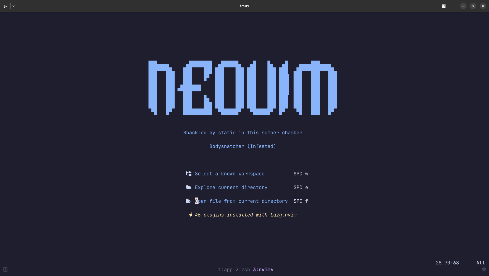
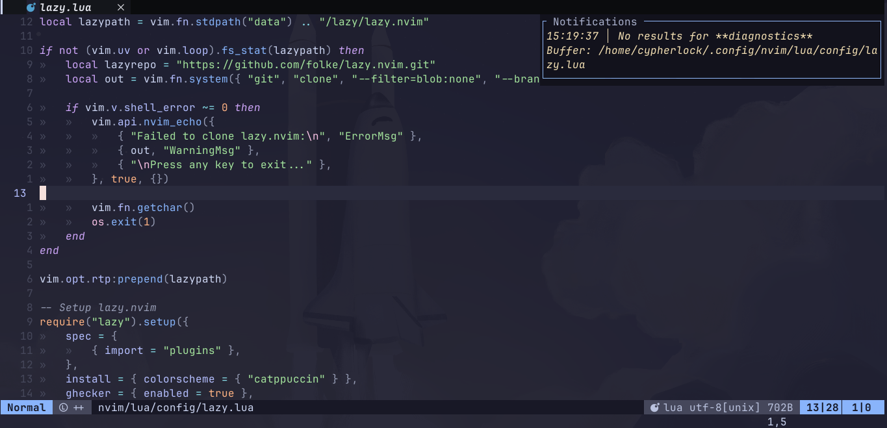
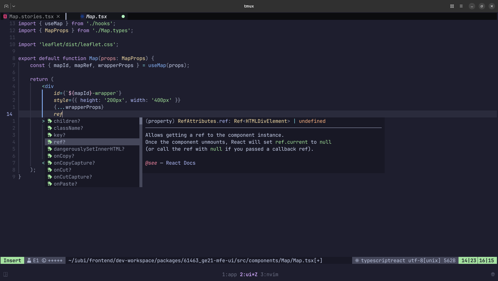
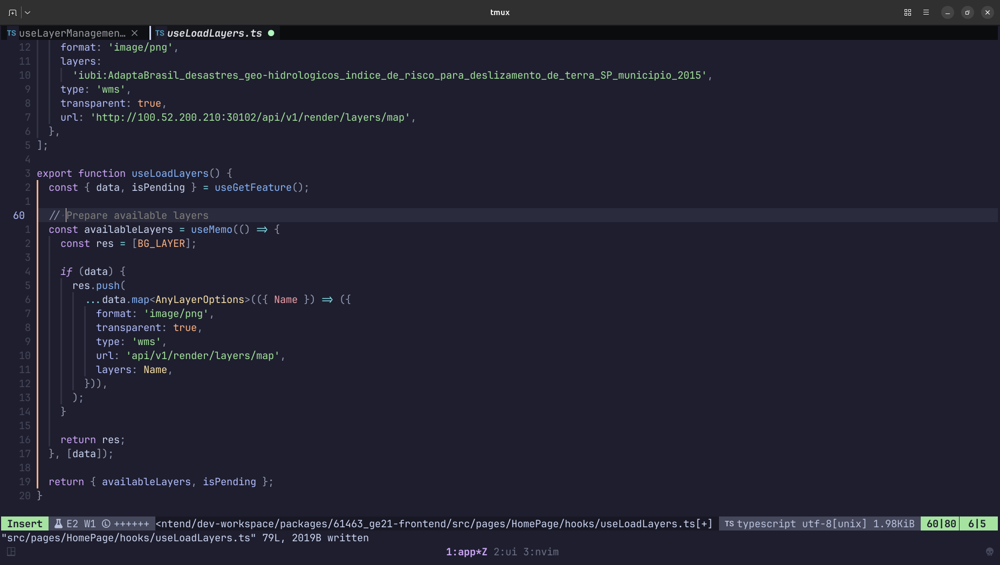

# nvim

This repository contains my current [Neovim](https://neovim.io/) setup, used at work and for personal projects.

## Configurations

More specific configurations, such as pluggin toggles and language support, can be found in the easily change by following the steps bellow:
1. Create a copy of the `values_example.json` file in the root of the Neovim config (`~/.config/nvim/` by default) directory called `values.json`
2. Edit the `values.json` file to override the default settings (found in the `defaults.json` file in the same directory)


```json
// defaults.json
// Use the same structure for values.json
{
  "development": {
    "languages": ["c", "lua", "vim", "vimdoc", "query", "csv", "json", "json5"],
    "lsps": ["bashls", "hyprls", "jsonls", "lua_ls", "marksman", "harper_ls"],
    "formatters": ["ast-grep", "prettier", "prettierd", "shfmt", "stylua"],
    "linters": ["jsonlint", "shellharden"]
  },
  "toggles": {
    "copilot": false,
    "format_on_save": true
  }
}
```

### List of toggleable plugins

- `github/copilot.nvim`

## Preview





