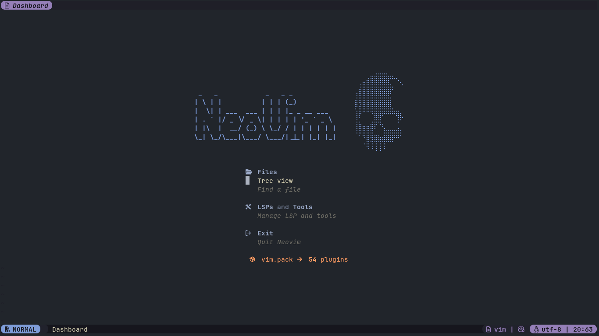
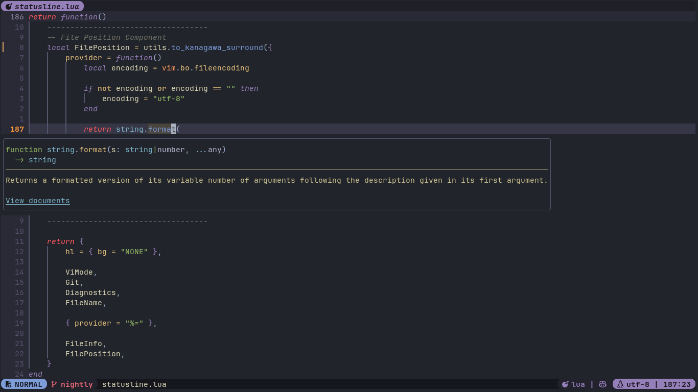
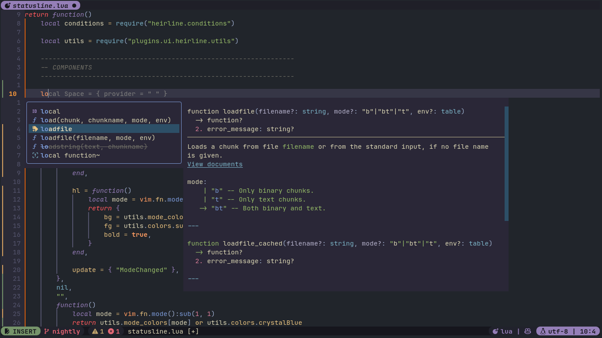
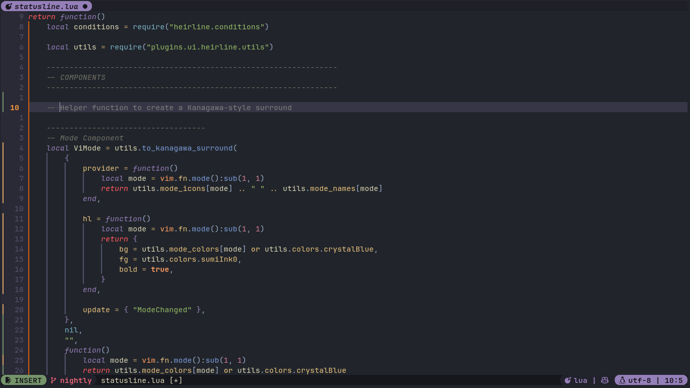

# Nvim

This repository contains my current [Neovim](https://neovim.io/) setup, used at work and for personal projects.

> You can always find the latest version of my configuration in the [`nightly`](https://github.com/leo-alvarenga/nvim/tree/nightly) branch

For the complete list of plugins and configurations, please refer to the [Plugin List](#plugin-list) section at the end of this document.

> Make sure to also check my tmux configuration, which is designed to work seamlessly with this Neovim setup: [leo-alvarenga/tmux](https://github.com/leo-alvarenga/tmux)

## Configurations

More specific configurations, such as plugin toggles and language support, can be found and easily changed by editing the values inside the files found under `lua/values/`.

### List of Togglable Plugins

- `github/copilot.vim`
- `olimorris/codecompanion.nvim`
- `folke/sidekick.nvim`
- `supermaven-inc/supermaven-nvim`

### List of Available Themes

- `catppuccin` - _Catppuccin Mocha_
- `everforest` - _Everforest Dark_
- `kanagawa` - _Kanagawa Wave_
- `onedark` - _One Dark Pro_
- `tokyonight` - _Tokyo Night Storm_

## Preview

## Plugin List

- AI Integrations
  - [`github/copilot.vim`](https://github.com/github/copilot.vim)
  - [`olimorris/codecompanion.nvim`](https://github.com/olimorris/codecompanion.nvim)
  - [`folke/sidekick.nvim`](https://github.com/folke/sidekick.nvim)
  - [`supermaven-inc/supermaven-nvim`](https://github.com/supermaven-inc/supermaven-nvim)

- Git Integrations
  - [`f-person/git-blame.nvim`](https://github.com/f-person/git-blame.nvim)

- Language Support and LSP Configuration
  - [`mason-org/mason-lspconfig.nvim`](https://github.com/mason-org/mason-lspconfig.nvim)
    - Dependencies:
      - [`mason-org/mason.nvim`](https://github.com/mason-org/mason.nvim)
  - [`mason-org/mason.nvim`](https://github.com/mason-org/mason.nvim)
  - [`mfussenegger/nvim-lint`](https://github.com/mfussenegger/nvim-lint)
  - [`neovim/nvim-lspconfig`](https://github.com/neovim/nvim-lspconfig)
  - [`nvim-treesitter/nvim-treesitter`](https://github.com/nvim-treesitter/nvim-treesitter)
  - [`nvimtools/none-ls.nvim`](https://github.com/nvimtools/none-ls.nvim)
    - Dependencies:
      - [`nvimtools/none-ls-extras.nvim`](https://github.com/nvimtools/none-ls-extras.nvim)
  - [`rachartier/tiny-inline-diagnostic.nvim`](https://github.com/rachartier/tiny-inline-diagnostic.nvim)
  - [`saghen/blink.cmp`](https://github.com/saghen/blink.cmp)
  - [`stevearc/conform.nvim`](https://github.com/stevearc/conform.nvim)
  - [`WhoIsSethDaniel/mason-tool-installer.nvim`](https://github.com/WhoIsSethDaniel/mason-tool-installer.nvim)

- Miscellaneous
  - [`leo-alvarenga/drift.nvim`](https://github.com/leo-alvarenga/drift.nvim)
  - [`leo-alvarenga/quoth.nvim`](https://github.com/leo-alvarenga/quoth.nvim)
  - [`nmac427/guess-indent.nvim`](https://github.com/nmac427/guess-indent.nvim)
  - [`nvim-lua/plenary.nvim`](https://github.com/nvim-lua/plenary.nvim)

- UI and Productivity
  - [`akinsho/bufferline.nvim`](https://github.com/akinsho/bufferline.nvim)
    - Dependencies:
      - [`nvim-tree/nvim-web-devicons`](https://github.com/nvim-tree/nvim-web-devicons)
  - [`folke/todo-comments.nvim`](https://github.com/folke/todo-comments.nvim)
  - [`folke/trouble.nvim`](https://github.com/folke/trouble.nvim)
  - [`folke/twilight.nvim`](https://github.com/folke/twilight.nvim)
  - [`folke/ts-comments.nvim`](https://github.com/folke/ts-comments.nvim)
  - [`folke/which-key.nvim`](https://github.com/folke/which-key.nvim)
  - [`norcalli/nvim-colorizer.lua`](https://github.com/norcalli/nvim-colorizer.lua)
  - [`nvim-lualine/lualine.nvim`](https://github.com/nvim-lualine/lualine.nvim)
    - Dependencies:
      - [`nvim-tree/nvim-web-devicons`](https://github.com/nvim-tree/nvim-web-devicons)
  - [`nvim-mini/mini.comment`](https://github.com/echasnovski/mini.comment)
  - [`nvim-mini/mini.cursorword`](https://github.com/echasnovski/mini.cursorword)
  - [`nvim-mini/mini.move`](https://github.com/echasnovski/mini.move)
  - [`rcarriga/nvim-notify`](https://github.com/rcarriga/nvim-notify)
  - [`nvim-mini/mini.pairs`](https://github.com/echasnovski/mini.pairs)
  - [`nvim-mini/mini.pick`](https://github.com/echasnovski/mini.pick)
  - [`nvim-mini/mini.starter`](https://github.com/echasnovski/mini.starter)
  - [`nvim-mini/mini.surround`](https://github.com/echasnovski/mini.surround)
  - [`nvim-neo-tree/neo-tree.nvim`](https://github.com/nvim-neo-tree/neo-tree.nvim)
    - Dependencies:
      - [`nvim-lua/plenary.nvim`](https://github.com/nvim-lua/plenary.nvim)
      - [`MunifTanjim/nui.nvim`](https://github.com/MunifTanjim/nui.nvim)
      - [`nvim-tree/nvim-web-devicons`](https://github.com/nvim-tree/nvim-web-devicons)
  - [`nvim-telescope/telescope.nvim`](https://github.com/nvim-telescope/telescope.nvim)
    - Dependencies:
      - [`nvim-lua/plenary.nvim`](https://github.com/nvim-lua/plenary.nvim)
      - [`nvim-treesitter/nvim-treesitter`](https://github.com/nvim-treesitter/nvim-treesitter)
  - [`nvim-tree/nvim-web-devicons`](https://github.com/nvim-tree/nvim-web-devicons)
  - [`saghen/blink.indent`](https://github.com/saghen/blink.indent)
  - [`stevearc/oil.nvim`](https://github.com/stevearc/oil.nvim)
    - Dependencies:
      - [`nvim-tree/nvim-web-devicons`](https://github.com/nvim-tree/nvim-web-devicons)
  - [`windwp/nvim-ts-autotag`](https://github.com/windwp/nvim-ts-autotag)
  - [`pmizio/typescript-tools.nvim`](https://github.com/pmizio/typescript-tools.nvim)
    - Dependencies:
      - [`neovim/nvim-lspconfig`](https://github.com/neovim/nvim-lspconfig)
      - [`nvim-lua/plenary.nvim`](https://github.com/nvim-lua/plenary.nvim)
  - [`kevinhwang91/nvim-ufo`](https://github.com/kevinhwang91/nvim-ufo)
    - Dependencies:
      - [`kevinhwang91/promise-async`](https://github.com/kevinhwang91/promise-async)
  - [`nvim-treesitter/nvim-treesitter-context`](https://github.com/nvim-treesitter/nvim-treesitter-context)
  - [`aikhe/wrapped.nvim`](https://github.com/aikhe/wrapped.nvim)
    - Dependencies:
      - [`nvzone/volt`](https://github.com/nvzone/volt)
  - [`gbprod/yanky.nvim`](https://github.com/gbprod/yanky.nvim)
    - [`kkharji/sqlite.lua`](https://github.com/kkharji/sqlite.lua)
  - [`rmagatti/goto-preview`](https://github.com/rmagatti/goto-preview)
    - [`rmagatti/logger.nvim`](https://github.com/rmagatti/logger.nvim)
  - [`ruicsh/tailwindcss-dial.nvim`](https://github.com/ruicsh/tailwindcss-dial.nvim)
    - [`monaqa/dial.nvim`](https://github.com/monaqa/dial.nvim)

## License

This project is licensed under the GPLv3 license - see the [LICENSE](./LICENSE) file for details.
