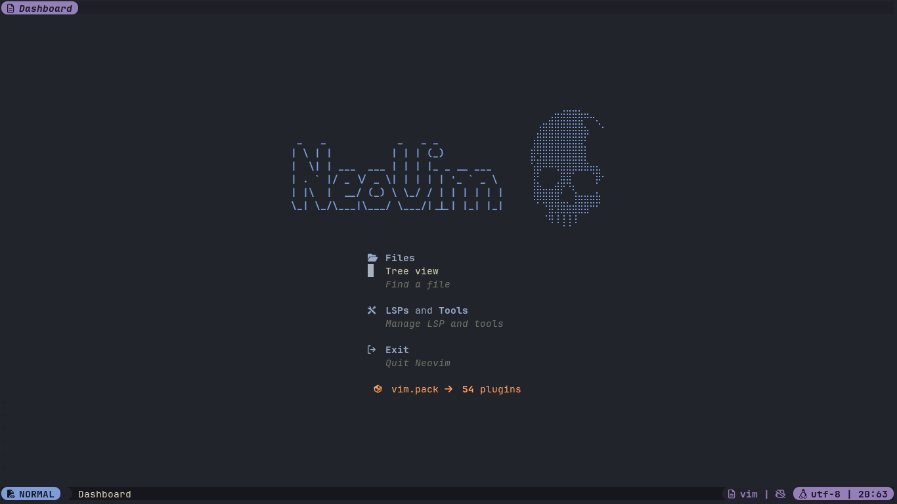
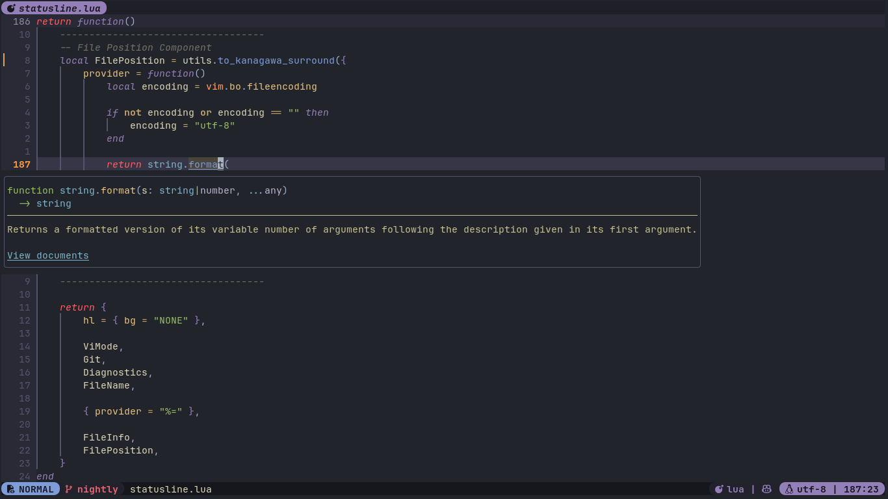
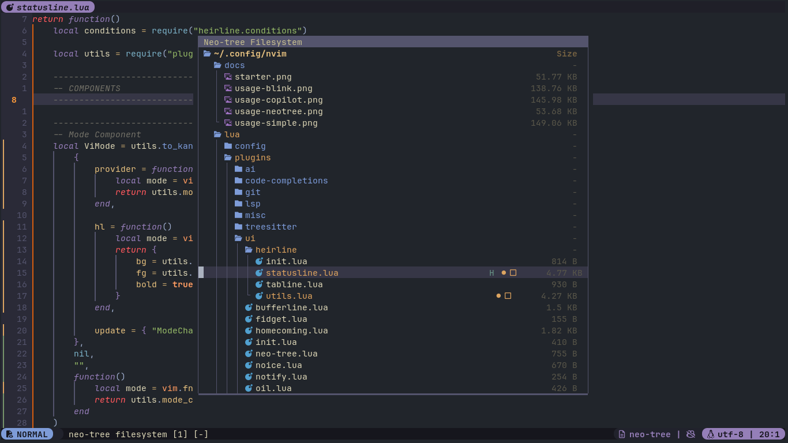
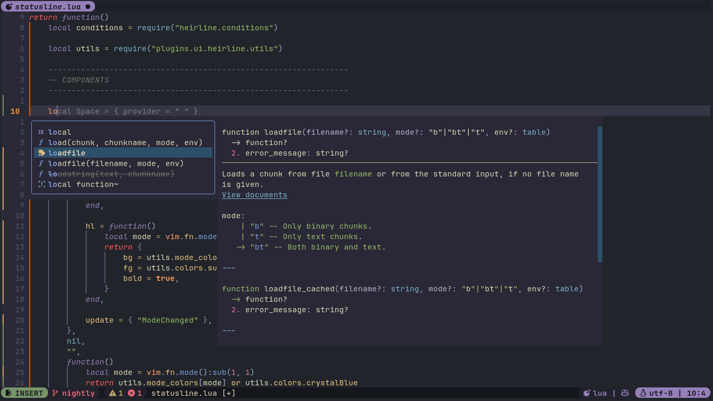
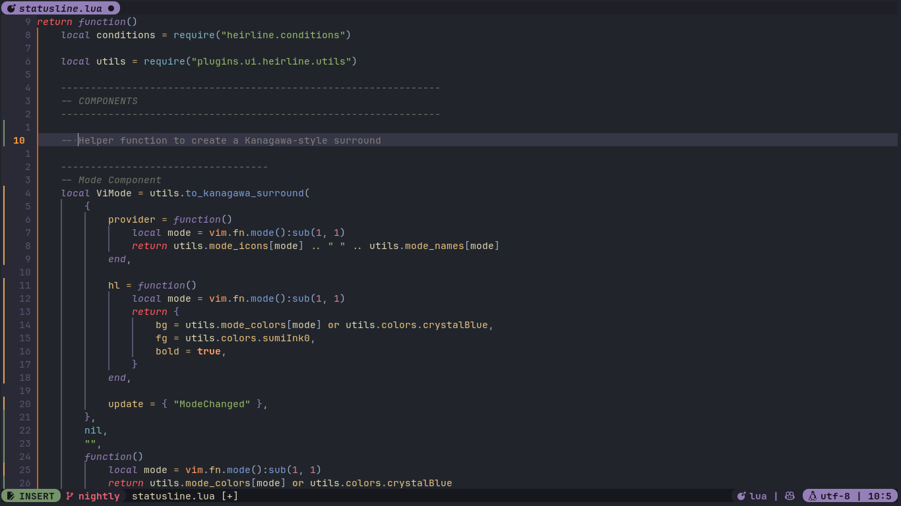

# Nvim

This repository contains my current [Neovim](https://neovim.io/) setup, used at work and for personal projects.

## Requirements

- Neovim 0.12 or higher
- `tree-sitter` CLI tool for syntax highlighting and code parsing
- `ripgrep` for file searching and live grep functionality
- `fd` for fast file searching in the file explorer
- `node` and `npm` for managing plugins that require Node.js
- `python3` and `pip` for Python-based plugins and language servers
- `lua` and `lua-rocks` for Lua-based plugins and configurations
- `cargo` for Rust-based plugins and language servers

> You can always find the latest version of my configuration in the [`nightly`](https://github.com/leo-alvarenga/nvim/tree/nightly) branch

> Make sure to also check my tmux configuration, which is designed to work seamlessly with this Neovim setup: [leo-alvarenga/tmux](https://github.com/leo-alvarenga/tmux)

> Check out my Neovim plugins, which are also used in this configuration:
>
> - [leo-alvarenga/homecoming.nvim](https://github.com/leo-alvarenga/homecoming.nvim) - Startup screen/dashboard plugin
> - [leo-alvarenga/mantel.nvim](https://github.com/leo-alvarenga/mantel.nvim) - My go-to Tabline/bufferline plugin
> - [leo-alvarenga/quoth.nvim](https://github.com/leo-alvarenga/quoth.nvim)

## Configurations

### List of Available Themes

- `catppuccin` - _Catppuccin Mocha_
- `everforest` - _Everforest Dark_
- `kanagawa` - _Kanagawa Wave_
- `onedark` - _One Dark Pro_
- `tokyonight` - _Tokyo Night Storm_

## Preview

## License

This project is licensed under the GPLv3 license - see the [LICENSE](./LICENSE) file for details.
